# Pipelines — FarmLab Investigator

Este documento descreve os fluxos do MVP. Os diagramas usam Mermaid e devem permanecer alinhados ao `SPEC.md`.

## 1. Arquitetura geral

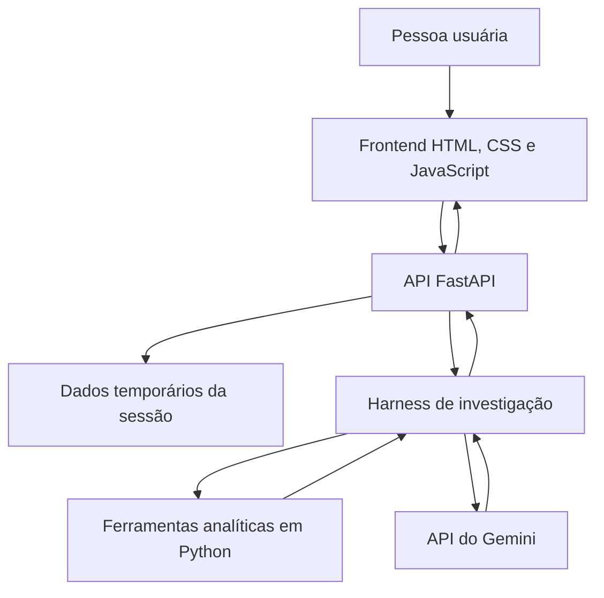

Responsabilidades:

- o frontend coleta arquivos e escolhas, mostra progresso e renderiza a resposta;
- o frontend também oferece prévias locais e rotuladas das telas futuras, sem confundi-las com resultados calculados;
- a API valida requisições e mantém o estado temporário;
- as ferramentas calculam as métricas;
- o Gemini decide quais ferramentas usar e organiza a explicação;
- o harness controla chamadas, valida evidências e produz o trace.

## 2. Fluxo completo da apresentação

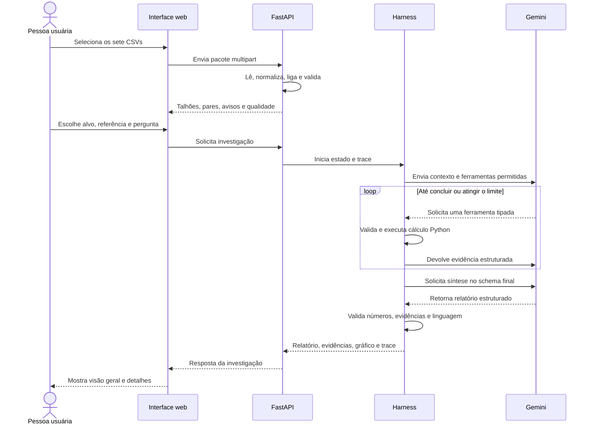

## 2.1 Fluxo temporário das prévias de interface

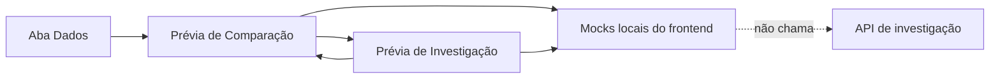

Regras do fluxo temporário:

- a navegação entre as três áreas é clicável independentemente do backend de investigação;
- Comparação e Investigação exibem o selo **Prévia · dados demonstrativos**;
- os mocks existem somente para validar layout, responsividade e interação;
- a importação real continua usando a API; as prévias não escrevem no store nem alteram `dataset_id`;
- quando as Semanas 2 a 4 conectarem dados reais, os componentes visuais devem ser reaproveitados e os mocks removidos do caminho de produção.

## 3. Pipeline de importação

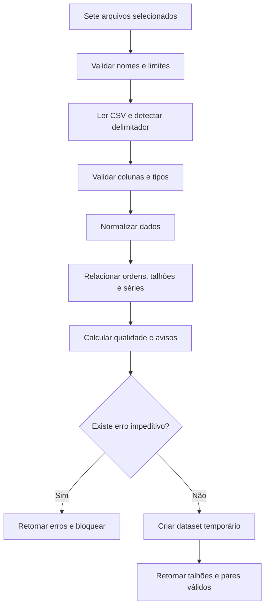

### Saída do pipeline

```text
dataset_id
status
quality_score
files[]
fields[]
valid_pairs[]
available_operations[]
warnings[]
errors[]
```

## 4. Relacionamento dos dados

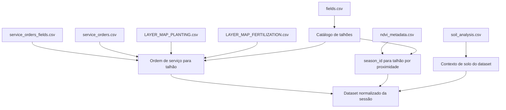

Regras de ligação:

- plantio e fertilização usam `Service Order`;
- a ordem é convertida em `idField` por `service_orders_fields.csv`;
- a série NDVI usa o centro dos bounds convertido para longitude e latitude;
- o centro é ligado ao centroide mais próximo em `fields.csv`;
- ligações ambíguas ou acima do limite são rejeitadas.
- `soil_analysis.csv` entra diretamente no escopo geral do dataset, sem vínculo com talhão;
- as colunas `_2` são preservadas como Conjunto 2, sem presumir profundidade.

## 4.1 Pipeline da análise de solo

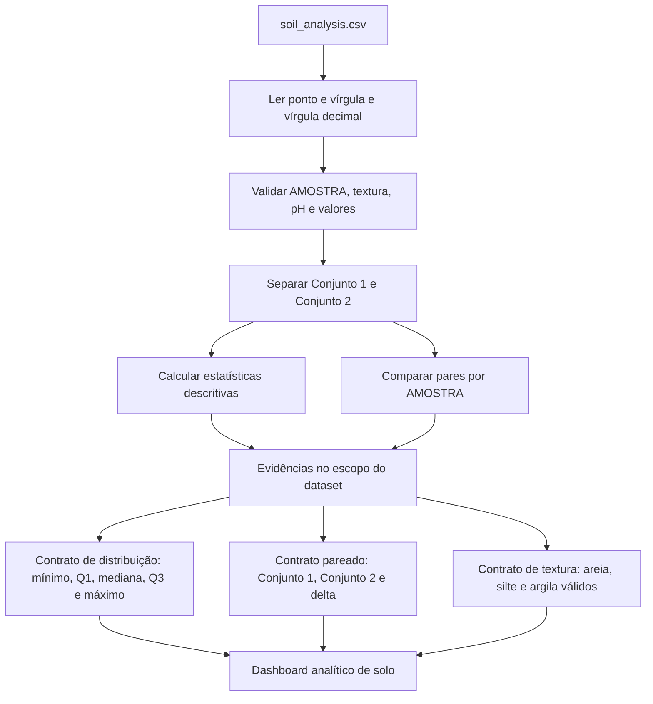

O fluxo não aplica faixas de suficiência, não atribui amostras a talhões e não interpreta `_2` como profundidade. O resultado apresenta contagem, média, mediana, extremos, quartis e deltas pareados quando disponíveis. Os contratos de visualização são calculados no backend e apenas renderizados no frontend.

Sem coordenada, data ou profundidade, o pipeline não produz mapa, tendência temporal nem perfil de camadas para o solo. A composição de textura só é disponibilizada para amostras válidas cuja soma esteja dentro da tolerância definida no `SPEC.md`; métricas com unidades distintas nunca são colocadas no mesmo eixo.

## 5. Pipeline de NDVI

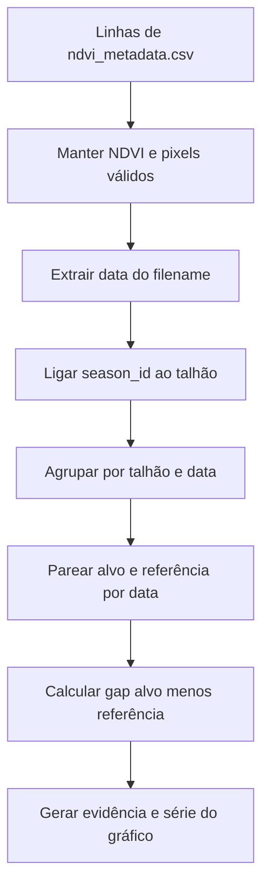

Não há interpolação. Uma data só entra na comparação se estiver válida nos dois talhões.

## 6. Pipeline de condição inicial

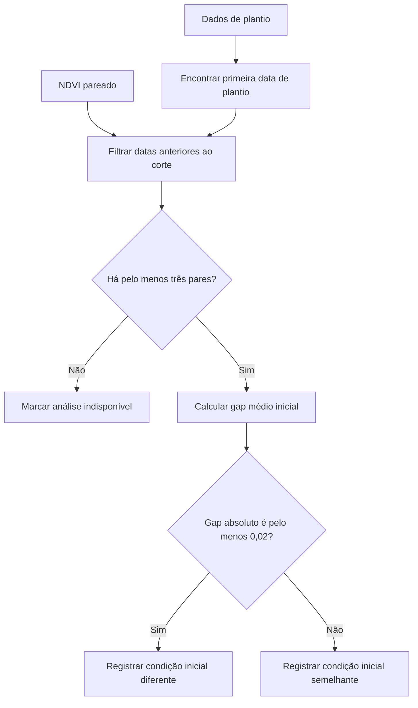

O limiar é uma regra operacional explícita, não um teste de significância.

## 7. Pipeline de população

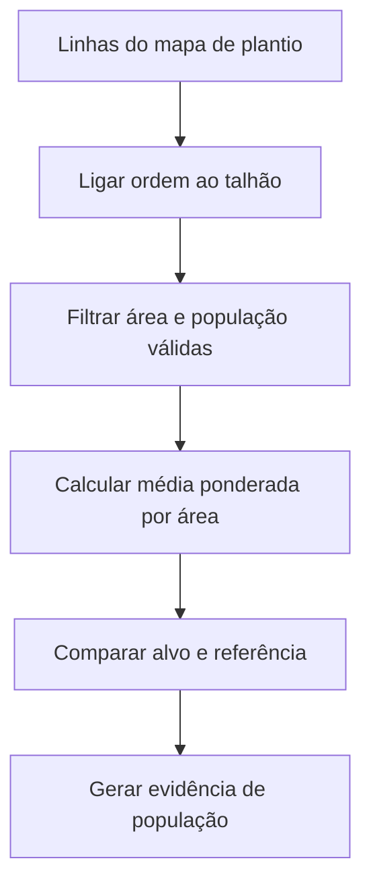

Fórmula:

```text
Σ(população × área) / Σ(área)
```

## 8. Pipeline de conformidade de aplicação

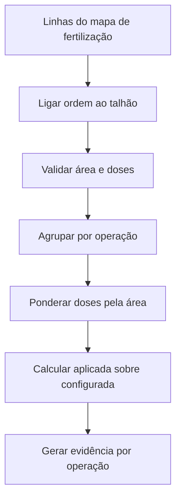

Fórmula:

```text
conformidade = dose_aplicada_ponderada / dose_configurada_ponderada × 100
```

## 9. Pipeline do harness

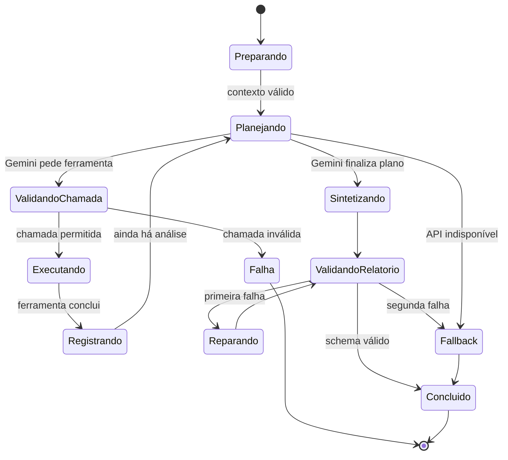

## 10. Registro de uma evidência

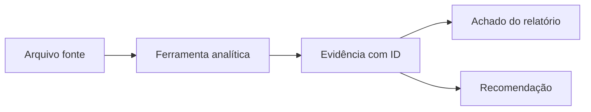

Cada evidência deve carregar:

- identificador;
- métrica e unidade;
- valor do alvo;
- valor da referência;
- diferença;
- quantidade de observações;
- arquivos fonte;
- método;
- versão da ferramenta.

## 11. Validação da síntese do Gemini

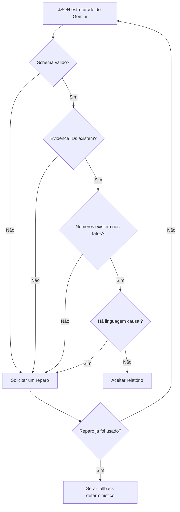

## 12. Pipeline de resposta na interface

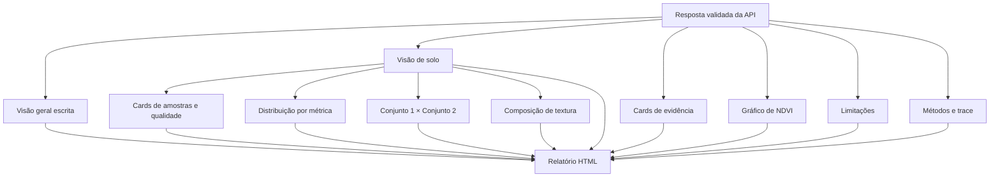

Cada gráfico da visão de solo deve possuir título, contexto, unidade, quantidade de observações, fonte e alternativa tabular acessível. Seletores alteram somente a apresentação de evidências já calculadas; não executam fórmulas paralelas no navegador.

## 13. Fluxo de erro e fallback

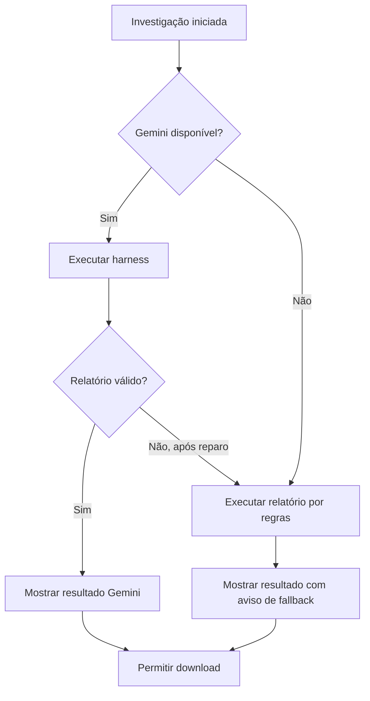

O fallback é uma proteção para a apresentação. Ele não pode ocultar a falha da API nem se identificar como resposta do Gemini.

## 14. Pipeline de execução local

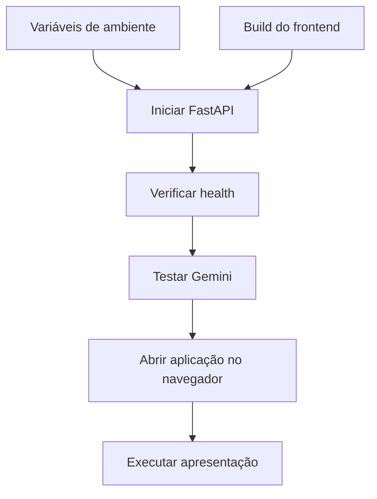

## 15. Limites entre componentes

| Componente | Pode fazer | Não pode fazer |
| --- | --- | --- |
| Frontend | selecionar arquivos, chamar API, renderizar | acessar chave ou calcular fatos oficiais |
| FastAPI | validar entrada, manter sessão, servir resposta | inventar evidências |
| Ferramentas Python | calcular e retornar evidências | escrever conclusão narrativa livre |
| Gemini | escolher ferramentas e redigir síntese | ler CSV bruto ou executar código |
| Harness | controlar, validar e rastrear | alterar valores calculados |
| Fallback | montar texto por regras | fingir que é Gemini |
